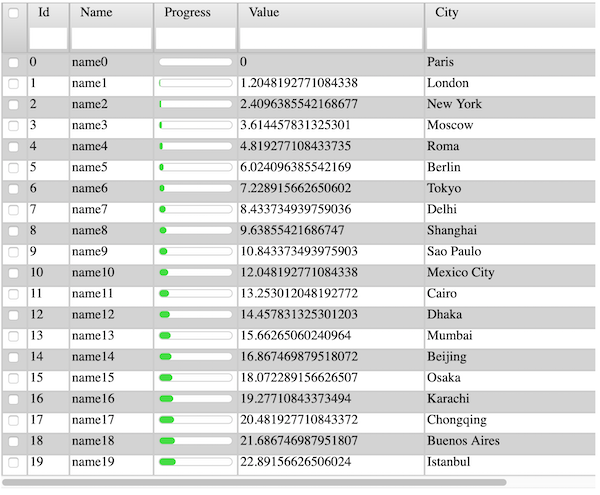

# Elm Advanced Grid

This library displays a dynamically configurable grid of data.

It offers in-place filtering and  sorting, multiple selection, click event listener and
customizable rendering of the rows and cells.
Columns can be resized using the mouse. They can also be reordered by drag and drop. 
 
The data can count more than 20,000 lines, with no performance impact, thanks to the use of [FabienHenon/elm-infinite-list-view](https://package.elm-lang.org/packages/FabienHenon/elm-infinite-list-view/latest/) under the hood.

See the src/Examples directory content for a full example. 